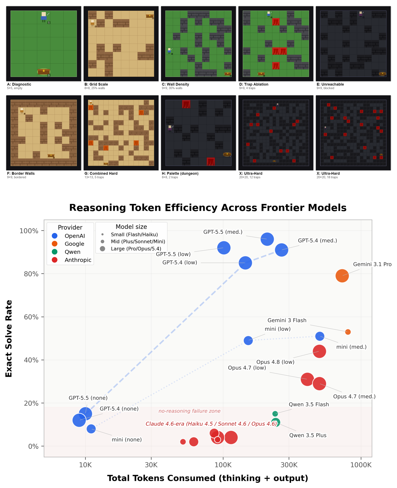

# MazeBench: Visual Maze Reasoning for Multimodal LLMs

<p align="center">
  
</p>

<p align="center">
  <b>Top:</b> Mazes from MazeBench at increasing difficulty (5x5 to 20x20). <b>Bottom:</b> Solve rate vs. total tokens consumed across frontier models.
</p>

> **Note on Claude's low scores.** Claude models struggle here because they often fail at the image→text grid extraction step. In the paper, we run an ablation where we feed Claude the text matrix representation of the maze directly, and performance jumps sharply. We leave it as-is in the main benchmark because MazeBench measures *vision+language* reasoning, not text-only reasoning.

<p align="center">
  <a href="https://arxiv.org/abs/2603.26839"></a>
  <a href="https://huggingface.co/datasets/albertoRodriguez97/MazeBench"></a>
  <a href="https://albertoagentic.com/maze-benchmark.html"></a>
</p>

This repository contains MazeBench, a benchmark and dataset for visually grounded maze reasoning with multimodal models. Each model receives only a maze image and a fixed prompt, then must decide whether the treasure is reachable and, if so, return one valid shortest path in JSON.

**Paper:** [From Pixels to BFS: High Maze Accuracy Does Not Imply Visual Planning](https://arxiv.org/abs/2603.26839)

**Blog post:** [maze_benchmark_blog.html](https://albertoagentic.com/maze-benchmark.html) (the original 10-maze experiment)

**Dataset:** [Hugging Face Hub](https://huggingface.co/datasets/albertoRodriguez97/MazeBench)

## What Is Included

- `benchmark/` — benchmark runner, prompt, provider adapters, parser, validation, and scoring
- `scripts/maze_generator/` — procedural maze generator with sprite rendering and annotation
- `paper/` — LaTeX source and figures for the arXiv paper
- `mazes_imgs/` — the 10 hand-curated maze images from the blog post
- `acl-style-files/` — ACL LaTeX formatting templates

## Benchmark Design

The benchmark keeps the setup intentionally simple:

- load maze images directly from a folder
- send the same fixed prompt to every model
- disable tool use in the API call
- avoid API-enforced structured outputs
- parse and validate JSON locally
- score predictions against manually transcribed shortest-path annotations

The main metric is `solved`: the model must identify reachability correctly and, on reachable mazes, return an accepted shortest path with the correct length.

## Project Layout

```text
benchmark/
  main.py
  prompts.py
  ground_truth/
    maze_annotations.json
  models/
    base.py
    openai_adapter.py
    anthropic_adapter.py
    dashscope_adapter.py
    gemini_adapter.py
    mock_adapter.py
  utils/
    evaluation.py
    image_loader.py
    json_parser.py
    results_writer.py
    validators.py
  outputs/
scripts/
  maze_generator/        # procedural maze generation
paper/
  maze_benchmark.tex     # LaTeX source
  maze_benchmark.pdf     # compiled paper
  references.bib
  *.png                  # figures
acl-style-files/         # ACL formatting templates
mazes_imgs/
  maze_1.jpg ... maze_10.png
```

## Requirements

- Python 3.10+
- Standard library only for the benchmark runner
- API keys via environment variables when running live models:
  - `OPENAI_API_KEY`
  - `ANTHROPIC_API_KEY`
  - `GEMINI_API_KEY`
  - `DASHSCOPE_API_KEY`

You can copy `.env.example` and export only the keys you need.

## Quick Start

Smoke test the full pipeline without external APIs:

```bash
python3 -m benchmark.main --model mock:baseline
```

Run the default OpenAI benchmark:

```bash
python3 -m benchmark.main
```

That default run uses:

- `openai:gpt-5.4`
- `openai:gpt-5.1`
- `--openai-reasoning-effort medium`
- `--max-output-tokens 8192`

## Example Commands

OpenAI:

```bash
python3 -m benchmark.main \
  --model openai:gpt-5.4 \
  --model openai:gpt-5.1 \
  --openai-reasoning-effort medium \
  --max-output-tokens 8192
```

Anthropic:

```bash
python3 -m benchmark.main \
  --model anthropic:claude-opus-4-6 \
  --model anthropic:claude-sonnet-4-6 \
  --anthropic-effort medium \
  --max-output-tokens 16384
```

```bash
python3 -m benchmark.main \
  --model anthropic:claude-haiku-4-5-20251001 \
  --anthropic-thinking-budget 4096 \
  --max-output-tokens 16384
```

Google:

```bash
python3 -m benchmark.main \
  --model gemini:gemini-3-pro-preview \
  --model gemini:gemini-3-flash-preview \
  --max-output-tokens 16384
```

DashScope / Qwen:

```bash
python3 -m benchmark.main \
  --model dashscope:qwen3.5-plus \
  --model dashscope:qwen3.5-flash \
  --max-output-tokens 4096
```

Run a subset of mazes:

```bash
python3 -m benchmark.main \
  --model openai:gpt-5.4 \
  --maze-name maze_1 \
  --maze-name maze_2
```

## Dataset

The 110-maze evaluation set from the paper is hosted on [Hugging Face](https://huggingface.co/datasets/albertoRodriguez97/MazeBench). It spans 8 structural families and grid sizes from 5x5 to 20x20, with ground-truth shortest-path annotations.

### Download

```bash
pip install huggingface_hub
huggingface-cli download albertoRodriguez97/MazeBench --repo-type dataset --local-dir generated_mazes/
```

Contents: 110 maze PNGs (`gen_maze_001.png` ... `gen_maze_110.png`) and `maze_annotations.json` with reachability, shortest path length, and accepted paths.

## Maze Generation

### Single mazes

Generate example mazes with sprite rendering:

```bash
python3 -m scripts.maze_generator
```

Outputs maze PNGs and a `maze_annotations.json` to `generated_mazes/`.

## Outputs

Every benchmark run writes a timestamped directory under `benchmark/outputs/` with:

- `raw_text/`: raw model text per maze
- `raw_payload/`: request and response snapshots with image payloads redacted
- `parsed/`: parsed JSON when recovery succeeds
- `summary.csv`: one row per model x maze
- `summary.jsonl`: JSONL version of the same rows
- `report.md`: short run summary

Generated outputs are intentionally gitignored.

## Prompt And Scoring

- Fixed prompt: `benchmark/prompts.py`
- Ground truth annotations: `benchmark/ground_truth/maze_annotations.json`
- Scoring logic: `benchmark/utils/evaluation.py`

The scorer treats a maze as solved only when:

- reachability is correct
- shortest-path length is correct
- the returned path matches one accepted shortest path annotation

## Citation

```bibtex
@article{rodriguezsalgado2026mazebench,
  title   = {From Pixels to BFS: High Maze Accuracy Does Not Imply Visual Planning},
  author  = {Rodriguez Salgado, Alberto},
  journal = {arXiv preprint arXiv:2603.26839},
  year    = {2026},
}
```

## Notes

- This repository is designed to be easy to extend with additional providers or evaluation rules.
- The benchmark does not attempt to verify internal reasoning traces.
- Weak performance on this task should be interpreted narrowly: it is evidence about this visual maze task, not a general ranking of model quality.
